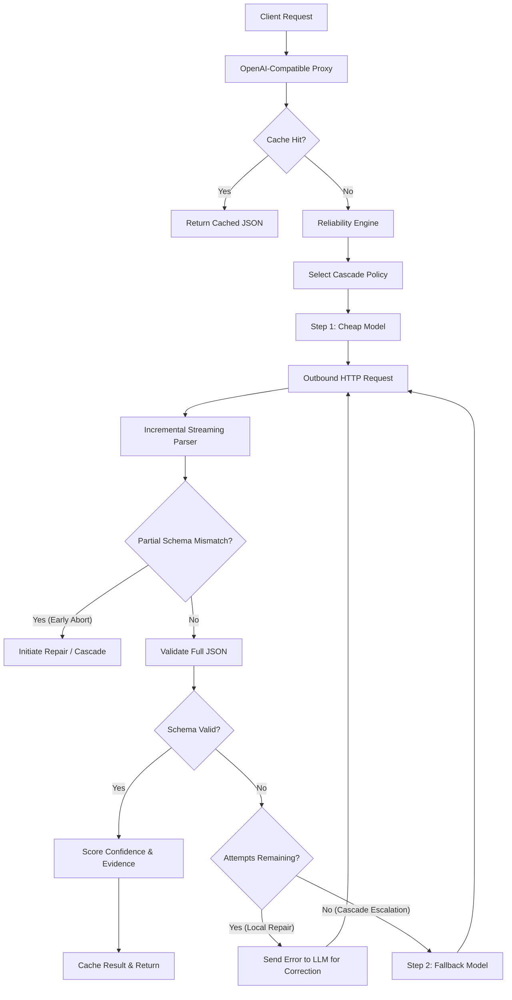

# 🌸 Misaki (美咲)

> **A production-ready, typed reliability gateway for LLM structured outputs.**

---

## 1. The Problem: Why LLM Outputs Fail in Production

Modern software engineering is built on **determinism**. We expect databases to return schema-compliant tables, compilers to reject type violations, and API endpoints to validate payload structures.

Large Language Models (LLMs) operate on **probability**. They do not compile schemas; they predict the next token based on statistical weights. This mismatch creates a critical fragility when building production applications:

1. **Syntactic Failures (JSON Malformation):** LLMs frequently drop closing braces `}`, emit trailing commas, or embed markdown block ticks (e.g., ` ```json `) inside their raw output, causing standard JSON parsers to crash.
2. **Semantic Schema Drift:** Even if the output is valid JSON, LLMs often omit required keys, assign wrong data types (e.g., a string instead of a float for price), or return unrequested fields.
3. **The Efficiency Dilemma (Cost vs. Latency vs. Accuracy):** 
   * Strong models (e.g., GPT-5.5, Claude 4.8 Opus) excel at structured output but are expensive and introduce higher latency.
   * Cheap models (e.g., GPT-4o-mini, Gemini 2.5 Flash) are fast and cheap but frequently fail complex schema validation.
4. **Network and Provider Instability:** Relying on a single model or provider makes applications highly vulnerable to rate limits, timeouts, and outages.

---

## 2. The Philosophy of Misaki

**Misaki** treats LLMs not as intelligent compute units, but as **unreliable, noisy communication channels**. 

Borrowing from computer networking principles, Misaki acts as a **reliability layer** (similar to TCP over IP). It sits between your application and the LLM providers, ensuring that what your application receives is guaranteed to be type-safe and schema-compliant, without requiring you to write complex retry-and-repair boilerplate in your application code.

### The Core Tenets of Misaki:

* **Zero-Trust Input/Output:** Never trust LLM output. Every response must pass strict JSON Schema validation before reaching the client application.
* **Optimistic Cascade Routing:** Run cheap models first. Only scale up to larger, more expensive models if the cheap model fails schema compliance and cannot be repaired.
* **Localized Self-Correction (Repair Loops):** If a response fails validation, Misaki doesn't discard it. It feeds the malformed output and the compiler's validation error back into the LLM, prompting it to repair its own mistakes locally in a tight feedback loop.
* **Non-Intrusive Integration:** Misaki is built as an OpenAI-compatible proxy server. You do not need to rewrite your application SDK calls; you simply change the `base_url` to point to Misaki.

---

## 3. Architecture

Misaki operates as a structured reliability gateway. Below is the lifecycle of a request entering the proxy:



---

## 4. Key Features

* **OpenAI-Compatible Proxy:** Drop-in proxy replacement supporting standard header authentication and OpenAI SDK payloads.
* **Cascades & Fallbacks:** Configure step-by-step routing cascades (e.g., `gpt-4o-mini` ➔ `claude-4.8-opus`) with automatic escalation on validation failure.
* **Local Self-Repair Loops:** Feeds raw compilation errors back to the generator to correct malformed structures, saving cost by preventing immediate fallback escalation.
* **Blended Confidence Scoring:** Integrates token-level logprobs ($e^{\text{logprob}}$) with repair-stability heuristics to assign a confidence percentage to each extracted field.
* **Incremental Streaming Parser:** Parses and reconstructs incomplete JSON tokens during streaming (SSE), triggering **early aborts** the moment a schema type-mismatch is structurally determined.
* **Per-Step Timeouts & Circuit Breakers:** Sets latency bounds on individual models and automatically trips open to skip failing providers during outages.
* **In-Memory Cache:** In-memory exact cache matching on prompt and schema configurations with custom TTLs.
* **Hot-Reloading Configuration:** Automatically watches `misaki.yaml` and hot-reloads providers, models, and policies without dropping active HTTP connections.

---

## 5. Configuration (`misaki.yaml`)

Misaki is configured using a declarative YAML file. It defines your providers, models, and cascade policies:

```yaml
server:
  host: "0.0.0.0"
  port: 8080

providers:
  openai:
    provider_type: "openai"
    api_key_env: "OPENAI_API_KEY"
  anthropic:
    provider_type: "anthropic"
    api_key_env: "ANTHROPIC_API_KEY"

models:
  gpt-mini:
    provider: "openai"
    model: "gpt-4o-mini"
  claude-opus:
    provider: "anthropic"
    model: "claude-4-8-opus"

policies:
  invoice-extraction:
    strategy: "cascade"
    steps:
      - model: "gpt-mini"
        timeout_ms: 3000
        accept_if:
          schema_valid: true
          confidence_gte: 0.90
      - model: "claude-opus"
        timeout_ms: 8000
        accept_if:
          schema_valid: true
    max_attempts: 4
```

---

## 6. Getting Started

### Prerequisites

* Rust (2024 Edition, Stable)
* Cargo

### Running Locally

1. **Set Environment Keys:**
   ```bash
   export OPENAI_API_KEY="your-openai-key"
   export ANTHROPIC_API_KEY="your-anthropic-key"
   ```

2. **Run the Proxy:**
   ```bash
   cargo run --release -p misaki-proxy
   ```
   The gateway starts listening on `http://0.0.0.0:8080`.

### Running with Docker

Misaki comes with a containerized multi-stage setup supporting hot-reloaded configurations:

1. **Run via Docker Compose:**
   ```bash
   docker-compose up --build
   ```

---

## 7. Usage Example

To route requests through Misaki, point your standard OpenAI SDK client to the Misaki proxy address and specify a policy name in the `model` parameter:

### Python Example

```python
from openai import OpenAI

# Point client to Misaki Gateway
client = OpenAI(
    base_url="http://localhost:8080/v1",
    api_key="not-needed-for-proxy-direct-auth"
)

response = client.chat.completions.create(
    model="invoice-extraction",  # Maps directly to the cascade policy
    messages=[
        {"role": "user", "content": "Retrieve invoice information from: Invoice #INV-8891, amount $123.40"}
    ],
    response_format={
        "type": "json_schema",
        "json_schema": {
            "name": "Invoice",
            "schema": {
                "type": "object",
                "properties": {
                    "invoice_number": {"type": "string", "pattern": "^INV-\\d+$"},
                    "amount": {"type": "number"}
                },
                "required": ["invoice_number", "amount"]
            }
        }
    }
)

print(response.choices[0].message.content)
# Output: {"invoice_number":"INV-8891","amount":123.4}
```

---

## 8. Development & Verification

To run unit and integration tests (which cover cascades, repairs, timeouts, circuit breakers, caching, logprobs scoring, and incremental parsing):

```bash
cargo test
```

To run clippy lint checks:

```bash
cargo clippy --all-targets
```
